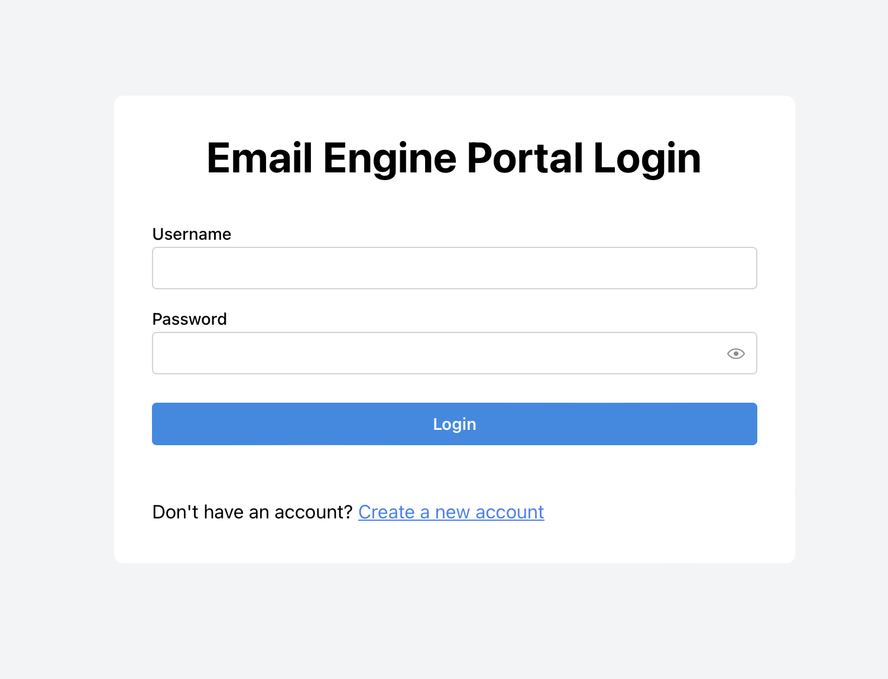
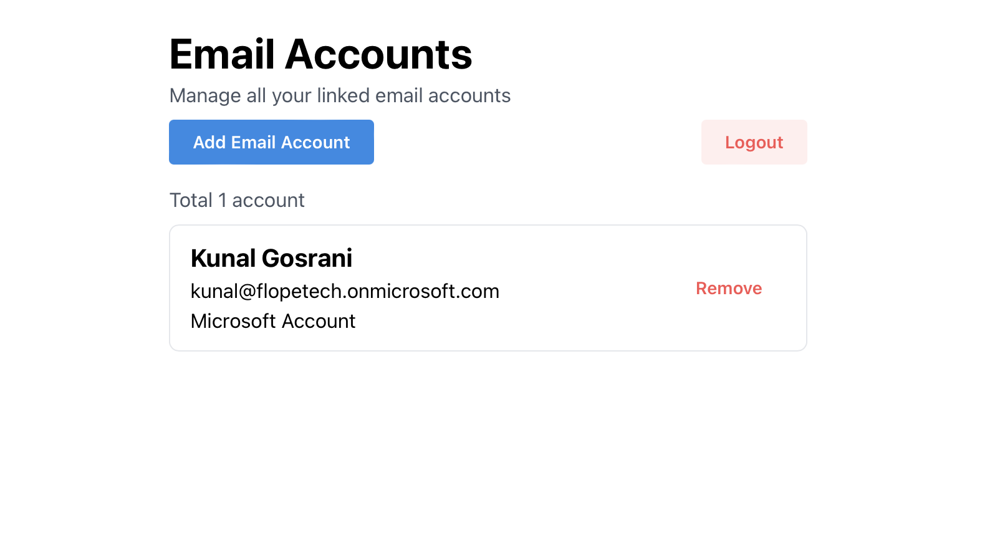
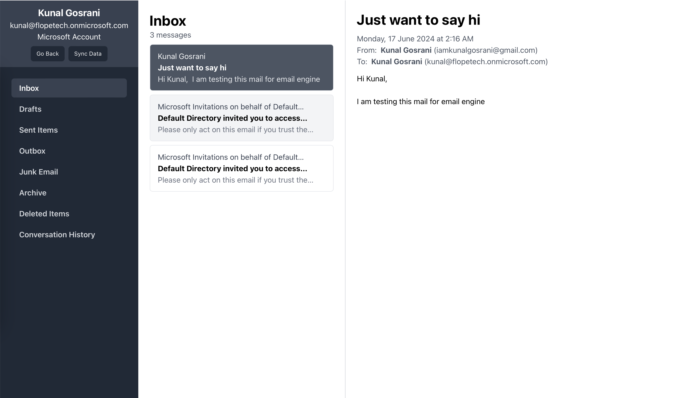

# Email Engine Core (Frontend)

This is the frontend repository for the Email Engine Core. It is built using [React](https://reactjs.org/), Vite, Tailwind CSS and [Mantine UI](https://mantine.dev/).
Also checkout [Email Engine Core (Backend) Repository](https://github.com/kunal-go/email-engine-backend)





## Features

- Email client where you can link your multiple email accounts and view all your emails in one place.
- Right now, only Microsoft Outlook is supported with Microsoft OAuth2.0 authentication.

## Setup and Installation

### Steps 1: Set environment variables

create `.env` file in the root directory and add the following environment variables:

```javascript
VITE_API_BASE_URL = "http://localhost:3000"; // URL of the backend server
```

### Steps 2: Install project dependencies

```bash
$ pnpm install
```

## Run the application

```bash
$ pnpm dev
```

## License

[MIT licensed](LICENSE).
